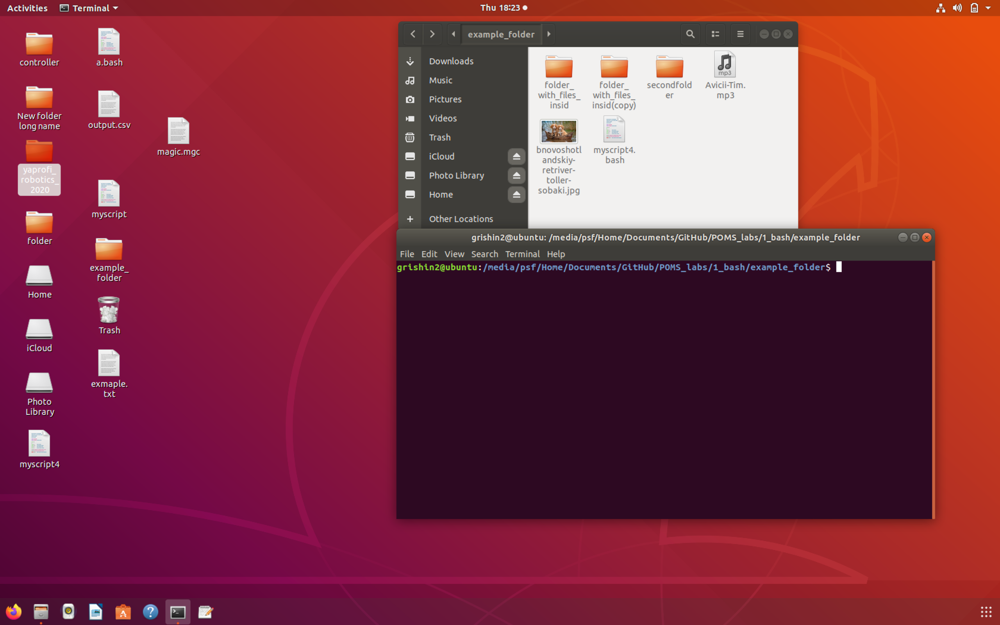
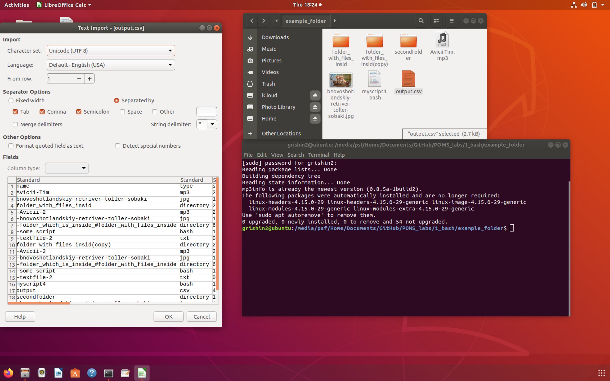
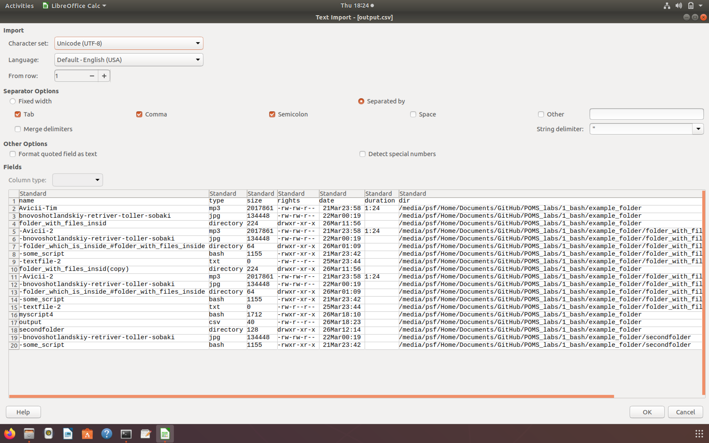

# отчет
– В качестве учебного пособия использован цикл [статей](https://habr.com/ru/company/ruvds/blog/325522/ ) .  
– Для проверки работоспособности есть тестовая папка example_folder.  
– При выполнении потребуется ввести пароль пользователя для загрузки пакета, определяющего длительность аудиофайлов.  
– Результаты выполнения скрипта внутри тестовой папки проще всего оценить посмотрев картинки ex1..ex2. 
.


– Выходным файлом является output.csv.  
# Выводы

В ходе выполнения работы а также в процессе просмотра и оценки решений данной задачи другими был сделан вывод о недостатках используемых методов. А именно:

- использование ```ls -l``` лишает возможности получения имени файла/директории, содержащей пробелы и/или символы вроде ```<\*\_?\<\>> ```, так как при написании регулярного выражения надо к чему-нибудь "привязаться"(к началу или концу, но у) ```ls -l``` столько информации в строке, что не поймешь, где начало имени.

- Использовать сторонний пакет ( в данном случае ```mp3info``` ) не стоит, так как для работы необходимо сначала установить его, это потребует пароля пользователя. Корректнее и универсальнее использовать <ffmpeg>.

Вместо парсинга очередной строки из "ls -l" с помощью "awk" логичнее получать необходимые атрибуты о файле (из, например, <../*> отдельными командами с использованием регулярных выражений.

Скрипт [script.bash](https://github.com/grishinKirill/POMS_labs/blob/master/1_bash/script.bash) стоит рассматривать скорее как МОВЕТОН. Рекомендую обратить внимание на [пример 1](https://github.com/NightFozy/labs/blob/master/lab_1.sh) или на [пример 2](https://github.com/ToshbI4/ITMORobSoft/blob/master/first/lab1).