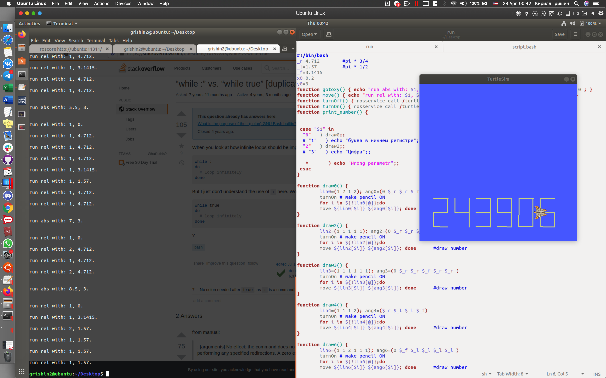

# Описание
Задача звучит так: используя пакет turtlesim, написать свой табельный номер(такой пишут, например, в студенческом билете). Реализация может быть самой разной: скрипт на С, Python или иным способом. Тут, кстати, можно было вообще аккуратно с клавиатуры набрать нужные команды в терминале.
# Что выбрал я?
В качестве отправной точки я взял запуск turtlesim. Посмотрел, что вообще есть "из коробки". Тем, кто здесь впервые, предлагаю проверить тоже:
В терминале запускаем ```roscore```
В новом терминале ```rosrun turtlesim turtlesim_node```. 
В новом терминале смотрим, какие запускаются ноды ```rosnode list```, какие есть топики```rostopic list ```, какие типы нужны топикам и```rostopic <topic> info```, и наконец, какие есть сервисы и информацию о них```rosservice type <type> | rossrv show```. В этот момент стало ясно, что мы уже можем перемещаться в место с указанными координатами и по относительному пути.

```rosservice call ```
Чтобы понять, как до этого дойти и что можно сделать еще, есть классный [туториал](http://wiki.ros.org/turtlesim/Tutorials/Rotating%20Left%20and%20Right) на [wiki.ros.org](http://wiki.ros.org).
# Что получилось
На данном этапе 23.04.2020 01:00 прописаны только цифры, необходимые для моего номера. Bash-cкрипт <run243906> надо запустить в отдельном терминале при работающей <turtlesim_node>. Результат получится, как на изображении ниже.

# Как заработать respect
Предлагаю конкурс на сникерс. Считаю, что если вы сможете разобраться в идеологии и сделать commit со своим скриптом, в котором будут дописаны недостающие цифры и реализован ввод с клавиатуры количества цифр и очередной цифры(заготовки для этого уже есть), то это будет достойно сладкого приза и отметки <lab3_max> в итоговой таблице.