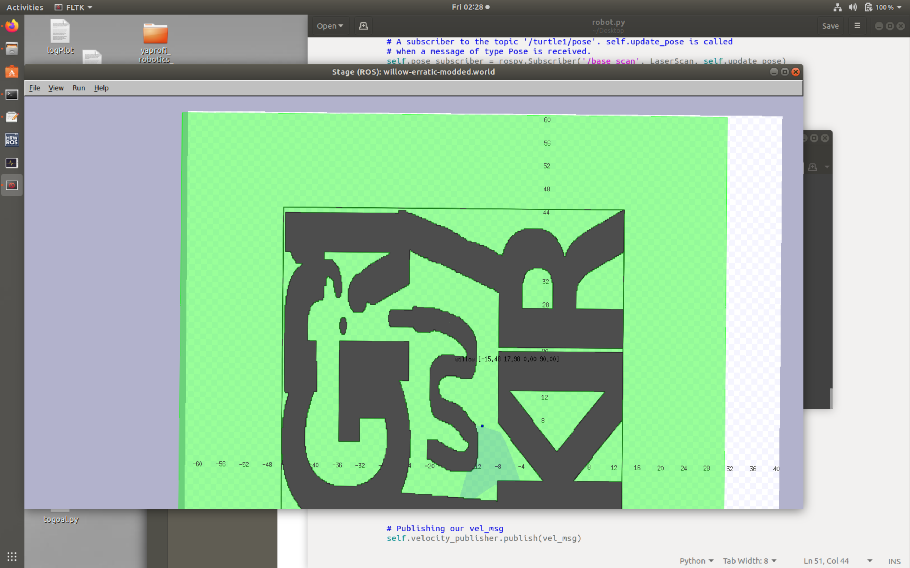

# Описание
Задача звучит так: бегать по лабиринту.

Чтобы понять, как до этого дойти и что можно сделать еще, есть классный [туториал](http://wiki.ros.org/stage/Tutorials/SimulatingOneRobot).

# Что получилось

В stage лабиринт выглядит так:


# Как установить необходимые зависимости
см.туториал выше.

# Как запустить
- в отдельном терминале ```roscore```
- в отдельном терминале ```rosrun stage_ros stageros <path>/willow-erratic-modded.world```


если хотите порулить с клавиатуры, то 
- в отдельном терминале ```rosrun teleop_twist_keyboard teleop_twist_keyboard.py```


если хотите посмотреть, что написал я для автономного движения кубика, то 
- в отдельном терминале ```python runner.py```